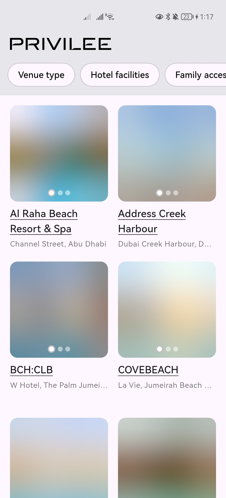
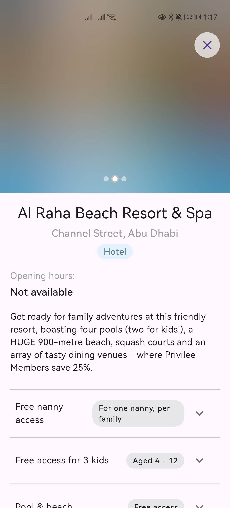
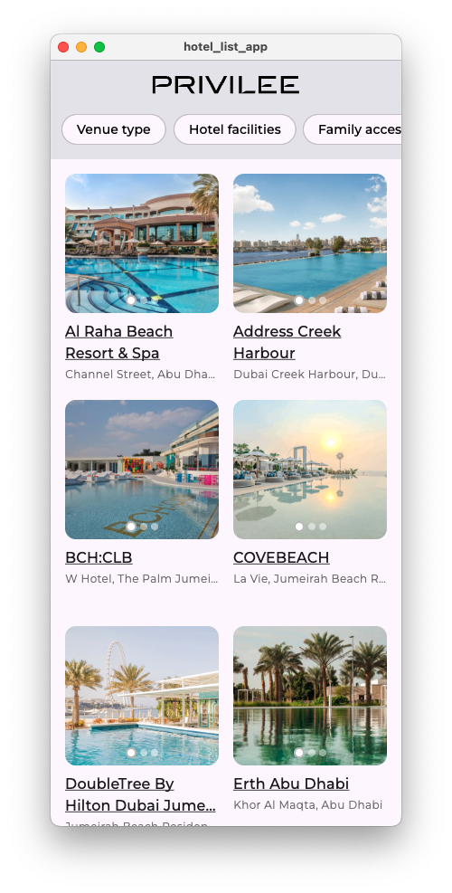
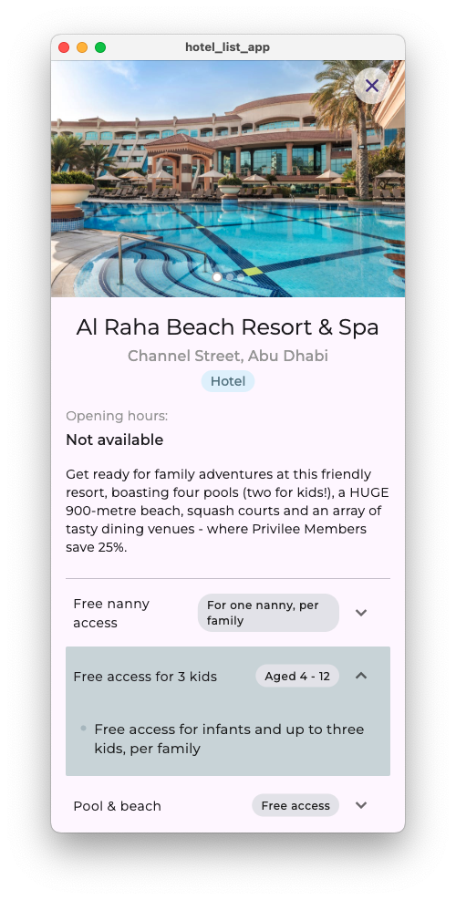
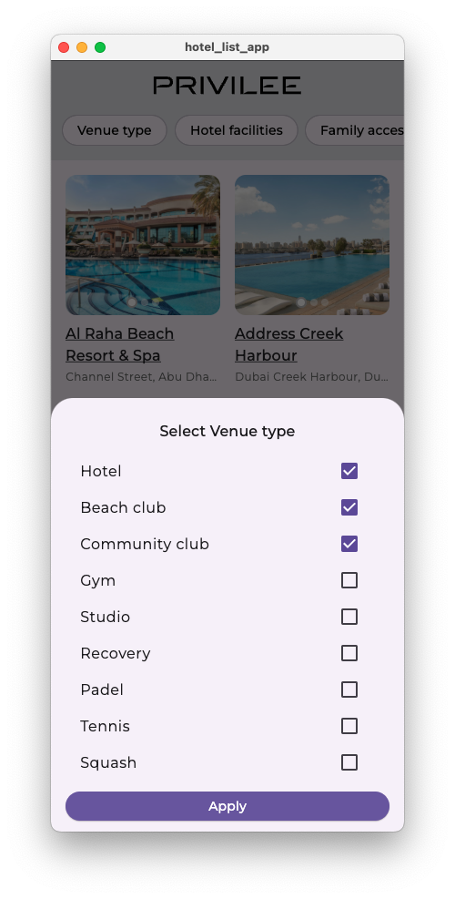

# Hotel List App

A feature-rich Flutter application showcasing venues (hotels and gyms) with advanced filtering capabilities, smooth animations, and robust error handling.

## Architecture & Project Structure

### Clean Architecture Implementation
- **Domain Layer** (`lib/features/venues/domain/`)
   - Entities
   - Use Cases
   - Repository Interfaces

- **Data Layer** (`lib/features/venues/data/`)
   - Models
   - Repositories Implementation
   - Data Sources (Remote & Local)

- **Presentation Layer** (`lib/features/venues/presentation/`)
   - Bloc (State Management)
   - Pages & Widgets
   - State/Event Handling

### Core Components (`lib/core/`)
-  API Service with Caching
-  Error Handling
-  Dependency Injection
-  Shared Utils & Constants

### Shared Components (`lib/shared/`)
-  Custom Widgets
-  Image Loading with Blur Hash
   
   
-  Loading Animations

## Features

### 1. Venue Management
-  List view with grid layout
-  Detailed venue information
-  Image carousel with blur hash loading
-  Smooth loading animations

### 2. Advanced Filtering System
-  Multiple filter categories
-  Bottom sheet filter UI
-  Multi-select categories

### 3. Data Management
-  Remote API Integration
-  Local Data Fallback
-  Caching Strategy
-  API Response Caching
-  Image Caching
-  Offline Support

### 4. Error Handling
-  Comprehensive Error States
-  Retry Mechanisms
-  User-Friendly Error Messages
-  Fallback Strategies

### 5. UI/UX Enhancements
-  Shimmer Loading Effects
-  Smooth State Transitions
-  Responsive Layout
-  Custom Styling
-  Optimized Image Loading

## Technical Implementation

### State Management
-  BLoC Pattern
-  Repository Pattern
-  Use Case Implementation
-  Dependency Injection (get_it)

### API Integration
-  Dio for HTTP Requests
-  Dio Cache Interceptor
-  Automatic Retry
-  Response Mapping

### Testing
-  Unit Tests
  ```sh
  flutter test
  ```
-  Widget Tests
-  Integration Tests
  ```sh
  flutter test integration_test/
  ```
-  Bloc Tests
-  Repository Tests

### Dependencies
-  flutter_bloc: State Management
-  get_it: Dependency Injection
-  equatable: Value Equality
-  dio & dio_cache_interceptor: API & Caching
-  cached_network_image: Image Caching
-  flutter_svg: SVG Support
-  shimmer: Loading Effects

##  Screenshots are located in the `screenshots/` directory.




##  Getting Started

1. **Clone the Repository**
   ```sh
   git clone https://github.com/sadaks-me/hotel_list_app
   ```

2. **Install Dependencies**
   ```sh
   flutter pub get
   ```

3. **Run the App**
   ```sh
   flutter run
   ```

##  Testing

- **Run All Tests:**
  ```sh
  flutter test
  ```

- **Run Integration Tests:**
  ```sh
  flutter test integration_test/
  ```

- **Generate Coverage Report:**
  ```sh
  flutter test --coverage
  ```

##  Build & Deploy

- **Build for Android:**
  ```sh
  flutter build apk
  ```

- **Build for iOS:**
  ```sh
  flutter build ios
  ```

##  Notes

-  Mock API endpoints can be configured in `lib/core/api/venue_endpoints.dart`
-  Local JSON data available in `assets/json/`
-  UI inspiration available in `ui_inspiration/`
-  Supports both iOS and Android platforms

##  What i could've added if more time was available

-  Dark Mode Support
-  Map Integration
-  Search Functionality
-  Analytics Integration
-  Push Notifications
-  Deep Linking


## TASK DESCRIPTION

Your task is to build a cross-platform mobile application for "Privilee" - a service that provides members with access to various venues like hotels and beach clubs. The application will display venue information, allowing users to filter venues and view details.

We don't expect you to spend more then two hours on this test, and it is okay if you cannot finish everything withing that time span. 

## Requirements

### Core Features
1. Create a venue listing screen that displays venues from the provided API response
2. Implement some filtering system that allows users to filter venues by, for example:
   - Venue type (Hotel, Beach club, Community club)
   - Hotel facilities (Beach, various pool types)
   - Family access options
   - Guest access options
3. Create a venue view that shows relevant information, like:
   - Venue images in a carousel
   - Overview information
   - Opening hours
   - Available activities ("Things to Do")
   - Location on a map

### Technical Requirements

1. **Architecture**
   - Implement state management, you are free to use any pattern you prefer
   - Create a clean, scalable project structure
   - Design a robust data model to represent venues and filters

2. **UI/UX**
   - Develop custom Flutter widgets for:
     - Filter selection
     - Venue cards 
     - Activity sections with collapsible content
     - Image carousel with pagination indicators
   - Ensure responsive design that works on both iOS and Android devices of various screen sizes

3. **API Integration**
   - Create an API service to parse and handle the provided JSON response
   - Implement error handling and loading states
   - Include pagination support for future API expansion

4. **Testing**
   - Write unit tests
   - Create widget tests for custom UI components
   - Implement at least one integration test for the filtering functionality

5. **Performance & Security**
   - Implement image caching for venue photos
   - Ensure app performance is optimized for smooth scrolling and transitions
   - Add appropriate security measures for API communication

## Deliverables

1. A git repository with a complete Flutter project with all source code
2. Documentation explaining:
   - Project architecture
   - How to run the application
   - Testing approach
   - Any third-party libraries used and why
3. A brief doc/readme explaining your design decisions and any challenges faced

## Evaluation Criteria

Your submission will be evaluated based on:

1. Code quality and organization
2. UI/UX design and responsiveness
3. Test coverage and quality
4. Performance optimization
5. Documentation clarity

## Bonus Points

1. Implementing offline support using local storage
2. Adding animations for a polished user experience
3. Including accessibility features
4. Creating a CI/CD pipeline for the project
5. Implementing deep linking to venue details

---

## Getting Started

The API response provided contains information about venues, including hotels and beach clubs, along with their amenities, images, and other details. Your application should parse this JSON and present it in an intuitive, user-friendly interface.

Use the following model structure as a starting point for your data classes:

```dart
// Example model structure (you should expand on this)
class Venue {
  final String id;
  final String name;
  final String city;
  final String type;
  final Coordinates coordinates;
  final String location;
  final List<VenueImage> images;
  final List<Category> categories;
  final Map<String, OperatingHours> openingHours;
  final bool accessibleForGuestPass;
  final List<Map<String, dynamic>> overviewText;
  final List<Activity> thingsToDo;
  
  // Constructor and methods
}

class Filter {
  final String name;
  final String type;
  final List<FilterCategory> categories;
  
  // Constructor and methods
}

// Additional model classes as needed
```

Good luck!
